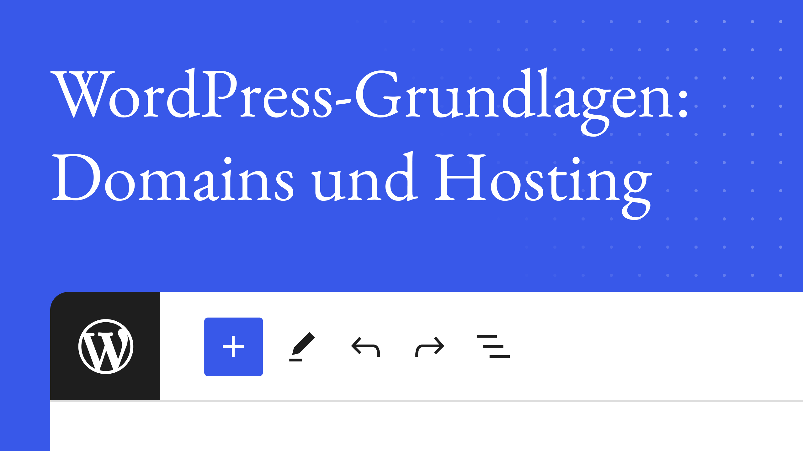

# Shot List

This list is a detailed list of all scenes and shots in the instructional video. It contains references to the media resources used, references to the relevant licenses and all time and cut markers.

An overview of all documents and files related to this project can be found in the [README](../README.md) file.

The timecodes are given in the Audio Timecode Format (ATF) "hours:minutes:seconds.milliseconds" or in the Video Timecode Format (VTF) "hours:minutes:seconds;frames". Unless otherwise specified, the Video Timecode Format (VTF) is used in this file.

## Chapters

## Additional material

### 00-01 Thumbnail

Created using the Thumbnail Generator, based on the original English version thumbnail.
Further information about the Thumbnail Generator can be found on the [Video Thumbnail Generator](https://make.wordpress.org/design/handbook/resources/figma-thumbnail-generator/) website.

## Chapter 01: Introduction
### Scene 01-01: Title Scene
### Scene 01-02: Showcase
### Scene 01-03: Domain & Hosting
## Chapter 02: Learning Outcomes
### Scene 02-01: Learning outcomes
## Chapter 03: Understanding Domains and Hosting
### Scene 03-01: Domain / Hosting
### Scene 03-02: Website = mobile home
### Scene 03-03: Domain = address
### Scene 03-04: Host = land
### Scene 03-05: Domain is a web address
### Scene 03-06: Coca-Cola website
### Scene 03-07: Coca-Cola URL
### Scene 03-08: Host services
### Scene 03-09: Changing the hosting company
### Scene 03-10: No change of domain
## Chapter 04: Bundling Domains with Hosting
### Scene 04-01: Choosing a hosting provider
### Scene 04-02: Hosting services and domain registration
### Scene 04-03: Bundling domain and hosting
### Scene 04-04: Buy domain name separately
## Chapter 05: Buying a Domain separately
### Scene 05-01: More control
### Scene 05-02: Select domain registrar
## Chapter 06: Selecting a Hosting Provider
### Scene 06-01: Selecting a hosting provider
### Scene 06-02: Reliability
### Scene 06-03: Scalability
### Scene 06-04: Security
### Scene 06-05: User-friendly interface
### Scene 06-06: Affordability
### Scene 06-07: See this in action
### Scene 06-08: Relevant features
## Chapter 07: Summary
### Scene 07-01: Summary
### Scene 07-02: Host, Domain
### Scene 07-03: Web hosting, Domain name
## Chapter 08: One-click solutions
### Scene 08-01: One-click solutions
### Scene 08-02: Domain name, WordPress, Hosting
### Scene 08-03: Remove technical hurdles
## Chapter 09: Hosting companies
### Scene 09-01: Many hosting companies
## Chapter 10: Conclusion
### Scene 10-01: Starting to plan your website