# Storyboard

This visual representation of the instructional video contains a detailed sequence of scenes and outlines the entire course of the video. It serves as a basic guide and starting point for the entire production.

An overview of all documents and files related to this project can be found in the [README](../README.md) file.

## Additional material

### 00-01 Thumbnail

Screenshot of the thumbnail image, as the original could not be found. 

| Name                                                           | Picture                                                                               | Spoken Text                                                                                                                                                                                                                                                                                                              |
| -------------------------------------------------------------- | ------------------------------------------------------------------------------------- | ------------------------------------------------------------------------------------------------------------------------------------------------------------------------------------------------------------------------------------------------------------------------------------------------------------------------ |
| <h2>Chapter 01: Introduction</h2>                              |                                                                                       |                                                                                                                                                                                                                                                                                                                          |
| <h3>Scene 01-01: Title Scene</h3>                              |                                 | Hi and welcome to Learn WordPress.                                                                                                                                                                                                                                                                                       |
| <h3>Scene 01-02: Showcase</h3>                                 | 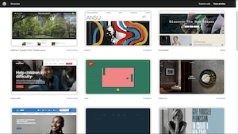                             | In this tutorial, we'll be discussing an essential aspect of setting up your website:                                                                                                                                                                                                                                    |
| <h3>Scene 01-03: Domain & Hosting</h3>                         |                      | choosing the right website domain and hosting provider.                                                                                                                                                                                                                                                                  |
| <h2>Chapter 02: Learning Outcomes</h2>                         |                                                                                       |                                                                                                                                                                                                                                                                                                                          |
| <h3>Scene 02-01: Learning outcomes</h3>                        | 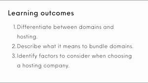                    | The learning outcomes for this lesson are to differentiate between domains and hosting, describe what it means to bundle domains and identify factors to consider when choosing a hosting company.                                                                                                                       |
| <h2>Chapter 03: Understanding Domains and Hosting</h2>         |                                                                                       |                                                                                                                                                                                                                                                                                                                          |
| <h3>Scene 03-01: Domain - Hosting</h3>                         |                      | Let's start by clarifying the difference between a host and a domain.                                                                                                                                                                                                                                                    |
| <h3>Scene 03-02: Website = mobile home</h3>                    |                   | Imagine your website is a mobile home,                                                                                                                                                                                                                                                                                   |
| <h3>Scene 03-03: Domain = address</h3>                         | 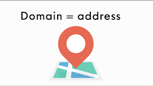                       | and your domain is the address,                                                                                                                                                                                                                                                                                          |
| <h3>Scene 03-04: Host = land</h3>                              | 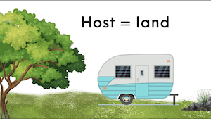                            | and your host is the land where your house or website is built.                                                                                                                                                                                                                                                          |
| <h3>Scene 03-05: Domain is a web address</h3>                  |                    | A domain is the unique web address that visitors type into their browsers to find your site.                                                                                                                                                                                                                             |
| <h3>Scene 03-06: Coca-Cola website</h3>                        |                              | For example, the domain name for the official Coca-Cola website                                                                                                                                                                                                                                                          |
| <h3>Scene 03-07: Coca-Cola URL</h3>                            | 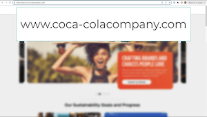                         | is www.cocacolacompany.com.                                                                                                                                                                                                                                                                                              |
| <h3>Scene 03-08: Host services</h3>                            |                         | On the other hand, a host is a service that stores your website's files and makes them accessible to users on the internet.                                                                                                                                                                                              |
| <h3>Scene 03-09: Changing the hosting company</h3>             |              | It is also important to note that you can change hosting companies if the need arises,                                                                                                                                                                                                                                   |
| <h3>Scene 03-10: No change of domain</h3>                      |                      | and it is possible to change your hosting company without changing your domain. But reach out to the new hosting company to ensure you follow the correct steps.                                                                                                                                                         |
| <h2>Chapter 04: Bundling Domains with Hosting</h2>             |                                                                                       |                                                                                                                                                                                                                                                                                                                          |
| <h3>Scene 04-01: Choosing a hosting provider</h3>              | 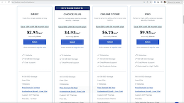                     | When it comes to choosing a hosting provider, you can look for one that bundles domains.                                                                                                                                                                                                                                 |
| <h3>Scene 04-02: Hosting services and domain registration</h3> | 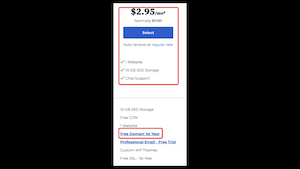 | This means the provider offers both hosting services and domain registration in one package.                                                                                                                                                                                                                             |
| <h3>Scene 04-03: Bundling domain and hosting</h3>              | 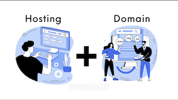              | Bundling domains with hosting simplifies the process, as you won't need to manage different accounts with different providers.                                                                                                                                                                                           |
| <h3>Scene 04-04: Buy domain name separately</h3>               | 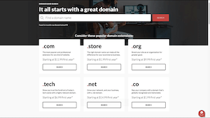            | Something to take note of is you can also buy domain names separately before signing up with a hosting company.                                                                                                                                                                                                          |
| <h2>Chapter 05: Buying a Domain separately</h2>                |                                                                                       |                                                                                                                                                                                                                                                                                                                          |
| <h3>Scene 05-01: More control</h3>                             | 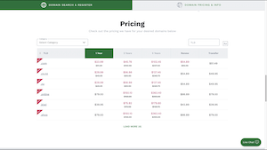                         | By purchasing the domain separately, you have more control over your domain settings. It also makes it easier to switch hosting providers. Just remember to keep track of your domain registration renewal dates.                                                                                                        |
| <h3>Scene 05-02: Select domain registrar</h3>                  | 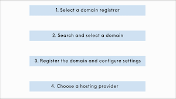              | The first step is to select a domain registrar, which is a company that manages the reservation of domain names. Secondly, search and select a domain name. You can also choose country-specific domains if you prefer. Then you can register the domain, configure domain settings, and then choose a hosting provider. |
| <h2>Chapter 06: Selecting a Hosting Provider</h2>              |                                                                                       |                                                                                                                                                                                                                                                                                                                          |
| <h3>Scene 06-01: Selecting a hosting provider</h3>             |            | When selecting a hosting provider, consider factors like                                                                                                                                                                                                                                                                 |
| <h3>Scene 06-02: Reliability</h3>                              | 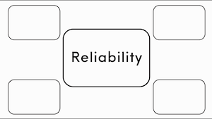                          | number one, reliability. Choose a provider with a good track record for uptime and reliable customer support.                                                                                                                                                                                                            |
| <h3>Scene 06-03: Scalability</h3>                              | 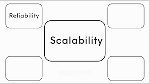                          | Number two, scalability. Opt for a provider that allows you to easily upgrade your hosting plan as your website grows.                                                                                                                                                                                                   |
| <h3>Scene 06-04: Security</h3>                                 | 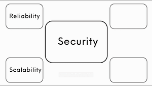                             | Number three, security. Ensure the hosting provider offers robust security features such as SSL certificates and regular backups.                                                                                                                                                                                        |
| <h3>Scene 06-05: User-friendly interface</h3>                  |               | Number four, user-friendly interface. Look for a provider with an intuitive control panel that makes it easy to manage your website.                                                                                                                                                                                     |
| <h3>Scene 06-06: Affordability</h3>                            | 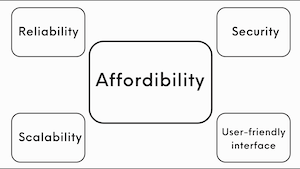                        | And lastly, affordability. Compare pricing plans to find a provider that offers the right features within your budget.                                                                                                                                                                                                   |
| <h3>Scene 06-07: See this in action</h3>                       | 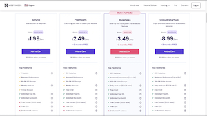                        | So let's see all of this in action. If you visit a hosting provider you will usually see different pricing plans                                                                                                                                                                                                         |
| <h3>Scene 06-08: Relevant features</h3>                        | 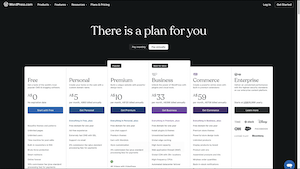                     | with the relevant features and information that you need to make an informed decision.                                                                                                                                                                                                                                   |
| <h2>Chapter 07: Summary</h2>                                   |                                                                                       |                                                                                                                                                                                                                                                                                                                          |
| <h3>Scene 07-01: Summary</h3>                                  | 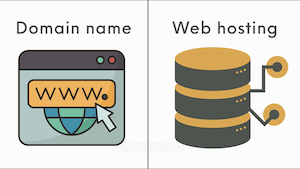                              | To sum up, understanding the distinction between a host and a domain is crucial for anyone looking to create a website.                                                                                                                                                                                                  |
| <h3>Scene 07-02: Host, Domain</h3>                             | 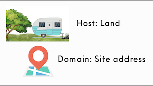                        | Remember, the host provides the space and resources for your website, while the domain serves as its unique address on the internet.                                                                                                                                                                                     |
| <h3>Scene 07-03: Web hosting, Domain name</h3>                 | 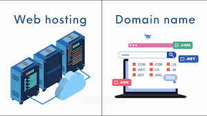              | Or to put it differently, a website hosting company provides a space on the internet, a server, where your website's files are stored. This enables people to access your website anytime by typing its address or its domain.                                                                                           |
| <h2>Chapter 08: One-click solutions</h2>                       |                                                                                       |                                                                                                                                                                                                                                                                                                                          |
| <h3>Scene 08-01: One-click solutions</h3>                      |                   | Many hosting companies also provide one-click solutions,                                                                                                                                                                                                                                                                 |
| <h3>Scene 08-02: Domain name, WordPress, Hosting</h3>          | 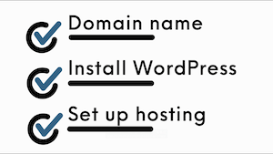             | allowing you to register a domain name, install WordPress, and set up hosting literally in one click.                                                                                                                                                                                                                    |
| <h3>Scene 08-03: Remove technical hurdles</h3>                 |              | This process removes any technical hurdles for users.                                                                                                                                                                                                                                                                    |
| <h2>Chapter 09: Hosting companies</h2>                         |                                                                                       |                                                                                                                                                                                                                                                                                                                          |
| <h3>Scene 09-01: Many hosting companies</h3>                   |                | There are a plethora of hosting companies to select from, and you have the choice to host your site wherever you choose. Please note these are only some examples, and there are many more hosting companies to explore.                                                                                                 |
| <h2>Chapter 10: Conclusion</h2>                                |                                                                                       |                                                                                                                                                                                                                                                                                                                          |
| <h3>Scene 10-01: Starting to plan your website</h3>            |                 | When you have registered a domain name and selected a hosting provider, you can start planning and designing your site.                                                                                                                                                                                                  |
