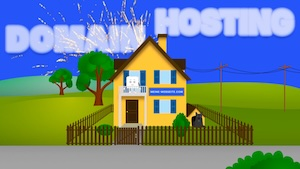

# Storyboard

This visual representation of the instructional video contains a detailed sequence of scenes and outlines the entire course of the video. It serves as a basic guide and starting point for the entire production.

An overview of all documents and files related to this project can be found in the [README](../README.md) file.

## Additional material

### 00-01 Thumbnail

The thumbnail image of the video was translated based on the thumbnail of the English version.

## Overview of Chapters and Scenes
The chapters are divided into scenes for production reasons, making updates easier.

| Name                                                            | Picture                                                          | Spoken Text                                                                                                                                                                                    | Design Description                                                                                                                                                                                                      |
| --------------------------------------------------------------- | ---------------------------------------------------------------- | ---------------------------------------------------------------------------------------------------------------------------------------------------------------------------------------------- | ----------------------------------------------------------------------------------------------------------------------------------------------------------------------------------------------------------------------- |
| <h2>Chapter 01: Introduction</h2>                               |                                                                  |                                                                                                                                                                                                |                                                                                                                                                                                                                         |
| <h3>Scene 01: Title Scene</h3>                               |  | Hello and welcome to Learn WordPress.                                                                                                                                                          | Zooming out from the thumbnail to reveal the full character.                                                                                                                                                            |
| <h3>Scene 02: Greeting</h3>                                  |             | Say hello to your new WordPress website.                                                                                                                                                       | The character smiles and waves.                                                                                                                                                                                         |
| <h3>Scene 03:   Feeling Lost</h3>                            |             | At the moment, it doesn't have a home and feels a bit lonely.  Let's change that now.                                                                                                    | The character looks sad and shivers.                                                                                                                                                                                    |
| <h3>Scene 04:  Hosting & Domain Basics</h3>                  |             | In this lesson, you'll learn how to find a good hosting provider, and get the right domain.  If you're not sure what that means, don't worry.  We'll explain everything in detail. | The words "Hosting" and "Domain" appear on the screen. The character looks at them with a puzzled expression.                                                                                                        |
| <h2>Chapter 02: What You Will Learn in This Lesson</h2>      |                                                                  |                                                                                                                                                                                                |                                                                                                                                                                                                                         |
| <h3>Scene 01: Lesson Goals</h3>                              |             | By the end of this lesson, you'll understand what hosting and domains are, why you need both, and how to choose the right provider.                                                            | A magnifying glass highlights the text, symbolising understanding. Then, a gift ribbon wraps around the text to indicate their connection. Dodgy providers appear, stressing the importance of choosing wisely.         |
| <h2>Chapter 03: What Is Hosting?</h2>                        |                                                                  |                                                                                                                                                                                                |                                                                                                                                                                                                                         |
| <h3>Scene 01:   What Is Hosting?</h3>                        |             | Let's start by taking a closer look at hosting.  Your website needs a place to stay.                                                                                                     | A quiet street, then a friendly cartoon website appears. In the distance, the word "Hosting" appears. The character walks towards a tent.                                                                   |
| <h3>Scene 02: Website Storage</h3>                           |             | This place is called hosting.  It's where all your content is stored and where it functions.                                                                                             | The website enters the tent, revealing shelves inside. It looks around, unimpressed.                                                                                                                              |
| <h3>Scene 03: Moving Hosts</h3>                              |             | There are many different types of hosting.  And if needed, your website can even be moved.                                                                                               | The website leaves the tent, carrying its belongings, and moves to the neighbouring house.                                                                                                                              |
| <h3>Scene 04: Choosing the Right Provider</h3>               |             | Your website likes it here.  But is this really the right provider?                                                                                                                      | The website enters an empty office, looking pleased. It turns to the camera with a questioning expression.                                                                                                        |
| <h2>Chapter 04: Criteria for Choosing the Right Hosting</h2> |                                                                  |                                                                                                                                                                                                |                                                                                                                                                                                                                         |
| <h3>Scene 01: Important Factors</h3>                         |             | Let's ask your website what's important for it.                                                                                                                                                | A close-up of the website character, thinking. A thought bubble appears.                                                                                                                                          |
| <h3>Scene 02:   Reliability</h3>                             |             | **Reliability:**  Your website needs to be online at all times.  A good provider guarantees stable availability and offers reliable support.                                       | A house is hit by a storm. A lightning strike causes a blackout, and an 'Offline' sign appears. Emergency workers quickly restore power, bringing the website back 'Online'.                             |
| <h3>Scene 03:   Scalability</h3>                             |             | **Scalability:**  If your website grows, your hosting provider should be able to grow with it.                                                                                        | The website stands in front of a house. A second, then multiple mini-websites appear. The house expands into a castle.                                                                                            |
| <h3>Scene 04:   Security</h3>                                |             | **Security:**  A good provider protects your website with SSL certificates and firewalls.                                                                                                | The website stands on a balcony as burglars attempt to break into the building. Security swiftly intervenes, driving them away. A sturdy fence is installed, and a guard dog is stationed to ensure protection.   |
| <h3>Scene 05:   User-Friendliness</h3>                       |             | **User-friendliness:**  Managing your hosting should be simple and intuitive.                                                                                                            | The office transforms into a complex sci-fi spaceship. The website looks confused. It is transported back to a simple office, feeling comfortable.                                                                |
| <h3>Scene 06:  Value for Money</h3>                          |             | **Value for money:**  Your provider should offer a good balance of cost and quality.                                                                                                     | The website looks stressed at an expensive bill. Then, it holds a fair-priced bill in one hand and money in the other, smiling.                                                                                   |
| <h3>Scene 07:   Choosing the Best Host</h3>                  |             | Now your website knows what matters.  And it has chosen the right hosting provider.                                                                                                      | The website unpacks in a well-furnished office.                                                                                                                                                                      |
| <h2>Chapter 05:   The Role of the Domain</h2>                |                                                                  |                                                                                                                                                                                                |                                                                                                                                                                                                                         |
| <h3>Scene 01: What is a Domain?</h3>                         |             | But how can people find your website?  For that, it needs a domain, its address on the internet.                                                                                   | The website stands on a balcony, looking lost. The street is empty, and a tumbleweed rolls by, emphasizing the need for an address.                                                                         |
| <h3>Scene 02: Registering a Domain</h3>                      |             | You can rent one from a domain registrar.  Most hosting providers will handle this for you.  So it's really easy.                                                                  | A large sign reading "MyWebsite.com" is hung on the house.                                                                                                                                                              |
| <h3>Scene 03: Keeping Your Domain</h3>                       |             | If you switch providers, you can take your domain with you.  This way, your website will always be available at the same address.                                                  | A crowd cheers for the website.                                                                                                                                                                                   |
| <h2>Chapter 06:   Summary</h2>                               |                                                                  |                                                                                                                                                                                                |                                                                                                                                                                                                                         |
| <h3>Scene 01: Hosting Summary</h3>                           |             | Let's summarize.  Hosting.                                                                                                                                                               | The website stands at a press, squeezing out the word "Hosting".                                                                                                                                                        |
| <h3>Scene 02: Hosting</h3>                                   |             | Hosting stores your WordPress website on a server.  So that it's accessible at all times.                                                                                                | The website zooms out to reveal a data centre.                                                                                                                                                                          |
| <h3>Scene 03: Domain Summary</h3>                            |             | Domain.                                                                                                                                                                                        | The website stands at a press, squeezing out the word "Domain".                                                                                                                                                         |
| <h3>Scene 04: Domain</h3>                                    |             | Your domain is your website's address on the internet.  It helps visitors find your website.                                                                                             | People browse on their phones, and the website character jumps out, making them happy.                                                                                                                                  |
| <h3>Scene 05: Conclusion</h3>                                |             | Together, hosting and a domain ensure that your website stays online, and is always accessible.                                                                                                | Hosting and domains ensure your website remains online and accessible. The website smiles proudly on a balcony as fireworks celebrate its success.                                                                      |
| <h2>Chapter 07: Conclusion</h2>                                 |                                                                  |                                                                                                                                                                                                |                                                                                                                                                                                                                         |
| <h3>Scene 01:   Starting to design your website </h3>        |             | Once you've registered a domain and chosen a hosting provider, you can start designing your website.                                                                                           | The website is shown in close-up. It transforms into a real human face, making a kiss gesture.                                                                                                                          |
| <h3>Scene 02:  Advertising</h3>                                 |             | Are you wondering how to do that?  We'll show you on Learn.WordPress.org.                                                                                                                | The scene is covered by a puzzle animation, revealing the Learn.WordPress.org logo.                                                                                                                                     |
